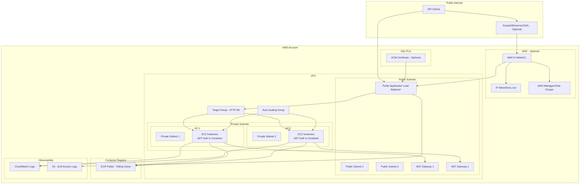
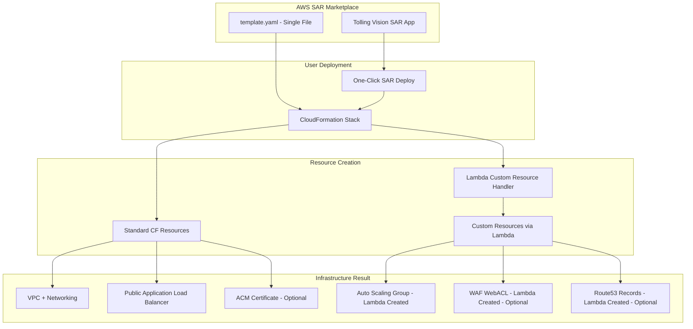

# Design Document

## Overview

**SIMPLIFIED ARCHITECTURE**: The Tolling Vision infrastructure uses a **simplified Lambda-based Custom Resource Strategy** with the Application Load Balancer as the single public entry point. This approach eliminates API Gateway complexity while maintaining SAR marketplace compatibility and supporting all required AWS resource types.

The architecture follows a streamlined approach with a public ALB directly serving traffic on ports 443 and 8443, routing to private EC2 instances running the Tolling Vision container. Optional WAF protection and JWT authentication are handled at the container level. All components are designed for high availability across multiple Availability Zones.

## SAR Limitations Analysis

### ❌ **Unsupported Resource Types**
AWS SAR does not support these critical resources:
- `AWS::AutoScaling::AutoScalingGroup` - Core auto scaling capability
- `AWS::AutoScaling::ScalingPolicy` - Dynamic scaling policies
- `AWS::EC2::LaunchTemplate` - Modern EC2 launch configuration
- `AWS::WAFv2::WebACL` - Optional WAF protection for ALB
- `AWS::WAFv2::IPSet` - IP allowlisting for WAF
- `AWS::Route53::RecordSet` - Optional DNS record management

### 📏 **Template Size Constraints**
AWS CloudFormation and SAR have template size limitations:
- **Direct Template Body**: 51KB maximum (51,200 bytes)
- **S3-based Templates**: 450KB maximum (460,800 bytes)
- **SAR Validation**: Supports both direct and S3-based validation methods
- **Template Optimization**: Lambda code embedding and mapping reduction strategies

### ✅ **Lambda Custom Resource Advantages**
- **SAR Compatibility**: Maintains marketplace presence and discoverability
- **Complete Feature Set**: All AWS resources supported via Lambda functions
- **Proven Pattern**: Based on successful WordPress Static Site Guardian implementation
- **Robust Error Handling**: Comprehensive timeout and failure management
- **CloudFormation Integration**: Proper resource lifecycle management
- **Size Management**: Optimized Lambda code embedding for template size compliance

## Lambda Custom Resource Strategy

### **Single SAR Template Architecture**
```
SAR Template (template.yaml):
├── Standard CloudFormation Resources:
│   ├── VPC, Subnets, Security Groups
│   ├── IAM Roles and Policies  
│   ├── Public Application Load Balancer
│   ├── ACM Certificate (optional)
│   └── CloudWatch Logs and Alarms
├── Lambda Custom Resource Handler:
│   ├── Embedded Python code (inline)
│   ├── Comprehensive error handling
│   └── Timeout management (14.5 min)
└── Custom Resources (Lambda-created):
    ├── Custom::AutoScaling → AWS::AutoScaling::AutoScalingGroup
    ├── Custom::LaunchTemplate → AWS::EC2::LaunchTemplate  
    ├── Custom::ScalingPolicy → AWS::AutoScaling::ScalingPolicy
    ├── Custom::WAF → AWS::WAFv2::WebACL + AWS::WAFv2::IPSet (optional)
    └── Custom::Route53 → AWS::Route53::RecordSet (optional)
```

### **Benefits of Single Template Approach**
1. **SAR Simplicity**: One template, one deployment, full marketplace compatibility
2. **No Nested Stacks**: Eliminates complexity and S3 dependencies
3. **Embedded Lambda**: All code inline in template for complete portability
4. **Standard + Custom**: Mix of native CloudFormation and Lambda-created resources
5. **Proven Pattern**: Based on successful WordPress Static Site Guardian implementation

### **Template Size Management Strategy**

**Size Constraints:**
- **Direct Template**: 51KB limit for `--template-body` parameter
- **S3-based Template**: 450KB limit for `--template-url` parameter
- **SAR Publishing**: Supports both direct and S3-based templates

**Optimization Techniques:**
1. **Lambda Code Compression**: Minimize embedded Python code using compact syntax
2. **Mapping Reduction**: Streamline instance type and AMI mappings
3. **Comment Removal**: Strip non-essential comments and documentation
4. **Parameter Consolidation**: Group related parameters efficiently

**Validation Workflow:**
```bash
# Check template size
wc -c template.yaml

# Direct validation (< 51KB)
aws cloudformation validate-template --template-body file://template.yaml

# S3-based validation (51KB-450KB)
aws s3 cp template.yaml s3://my-sar-artifacts-bucket/template.yaml
aws cloudformation validate-template --template-url https://my-sar-artifacts-bucket.s3.amazonaws.com/template.yaml
```

**Deployment Options:**
- **Small Templates**: Direct SAR deployment from marketplace
- **Large Templates**: S3-based deployment with template URL reference
- **Hybrid Approach**: Automatic size detection and deployment method selection

## Architecture



## Components and Interfaces

### 1. Networking Layer

**VPC Configuration:**
- New VPC with configurable CIDR (default: 10.0.0.0/16)
- Minimum 2 private subnets across different AZs (10.0.1.0/24, 10.0.2.0/24)
- 2 public subnets for ALB and NAT Gateways (10.0.101.0/24, 10.0.102.0/24)
- Internet Gateway for public subnet routing
- NAT Gateways in each AZ for private subnet egress
- Route tables configured for proper traffic flow

**Security Groups:**
- `ALBSecurityGroup`: Accepts public traffic on ports 443/8443 from internet (0.0.0.0/0)
- `EC2SecurityGroup`: Accepts traffic only from ALB on container ports 80/8080
- `EC2EgressSecurityGroup`: Allows outbound HTTPS (443) for license validation and ECR pulls

### 2. Compute Layer

**Launch Template:**
- AMI: Latest Amazon Linux 2023 (architecture-specific)
- User Data script for Docker installation and container startup
- Instance Profile with ECR pull and CloudWatch Logs permissions
- Security groups and key pair configuration
- Container environment variables injection

**Auto Scaling Group:**
- MixedInstancesPolicy supporting On-Demand/Spot percentage split
- Instance type selection based on ProcessCount and ImageArchitecture
- Health checks: EC2 and ELB
- Target group registration
- Scaling policies (optional future enhancement)

**Container Configuration:**
- Image: `public.ecr.aws/smartcloud/tollingvision:{ImageTag}`
- Exposed ports: 80 (HTTP/1.1)
- Environment variables: LicenseKey, ProcessCount, ConcurrentRequestCount, etc.
- JWT Authentication variables (optional): CognitoUserPoolId, CognitoRegion, CognitoAppClientId, CognitoRequiredScope
- Resource allocation based on ProcessCount (3GB + 1GB per additional process)

### 3. Load Balancing Layer

**Application Load Balancer:**
- Scheme: Internet-facing (public)
- Subnets: Public subnets across AZs
- Security group: ALBSecurityGroup
- Deletion protection: Enabled
- Optional ACM certificate for HTTPS/TLS termination

**Target Groups:**
- `TG-HTTP`: Protocol HTTP, Port 80, Health check path `/health` or `/`
- Health check settings: 30s interval, 5s timeout, 2 healthy/unhealthy thresholds

**Listeners:**
- Port 443: HTTPS/TLS → Routes to TG-HTTP (HTTP/1.1 traffic)
- Optional HTTP listeners on ports 80/8080 for redirect to HTTPS

### 4. DNS Layer (Optional)

**Route53 Records:**
- A/AAAA records pointing to ALB
- Configurable via SAR parameter (EnableDNS)
- Requires existing hosted zone
- Automatic record creation/update when enabled

**Domain Configuration:**
- Custom domain name (SAR parameter)
- ACM certificate for TLS termination
- DNS validation or manual certificate management

### 5. Authentication Layer (Container-based, Optional)

**JWT Authentication in Container:**
- Container handles JWT validation internally
- Environment variables for Cognito configuration:
  - `COGNITO_USER_POOL_ID`: Cognito User Pool ID
  - `COGNITO_REGION`: AWS region for Cognito
  - `COGNITO_APP_CLIENT_ID`: App Client ID for audience validation
  - `COGNITO_REQUIRED_SCOPE`: Required scope for API access
- Container validates JWT tokens against Cognito JWKS endpoint
- Returns 401 Unauthorized for invalid/missing tokens

### 6. Security Layer (Optional)

**WAFv2 WebACL:**
- Scope: REGIONAL (for Application Load Balancer)
- Associated resource: ALB
- Default action: ALLOW or BLOCK (configurable)

**AWS Managed Rule Groups (Free):**
- `AWSManagedRulesCommonRuleSet`: Common web application threats
- `AWSManagedRulesKnownBadInputsRuleSet`: Known malicious inputs
- `AWSManagedRulesLinuxRuleSet`: Linux-specific threats
- `AWSManagedRulesAmazonIpReputationList`: IP reputation filtering

**Custom IP Set Rule (Optional):**
- Priority: 1 (highest)
- Action: ALLOW or BLOCK (configurable)
- Statement: IP match condition using IPSet
- IPSet: Contains customer-provided CIDR ranges
- Supports both allow-listing and deny-listing patterns

## Data Models

### CloudFormation Parameters

```yaml
# Docker Image Parameters
LicenseKey: String (NoEcho)
ProcessCount: Number (1-64, Default: 1)
ConcurrentRequestCount: Number (Default: 1)
MaxRequestSize: Number (Default: 6291456) # 6MB in bytes
Backlog: Number (Default: 10)
BacklogTimeout: Number (Default: 60)
RequestTimeout: Number (Default: 30)
ImageArchitecture: String (arm64|x86-64)
ImageTag: String (Default: same as ImageArchitecture)

# EC2/ASG Parameters
DesiredCapacity: Number (Default: 0)
MinSize: Number (Default: 0)
MaxSize: Number (Required)
OnDemandPercentage: Number (0-100, Default: 100)
InstanceTypeOverrideList: CommaDelimitedList (Optional)
KeyPairName: String (Optional)

# Domain and SSL Parameters
DomainName: String (Optional) # Custom domain for ALB
CertificateArn: String (Optional) # ACM certificate ARN
EnableDNS: String (true|false, Default: false) # Create Route53 records
HostedZoneId: String (Optional) # Route53 hosted zone ID

# JWT Authentication Parameters (Container-based)
EnableJwtAuth: String (true|false, Default: false)
CognitoUserPoolId: String (Optional) # Existing Cognito User Pool ID
CognitoRegion: String (Optional) # Cognito region (defaults to stack region)
CognitoAppClientId: String (Optional) # App Client ID for audience validation
CognitoRequiredScope: String (Optional) # Required scope (e.g., "api/m2m")

# WAF Parameters
EnableWAF: String (true|false, Default: false)
WAFDefaultAction: String (ALLOW|BLOCK, Default: ALLOW)
IPSetAction: String (ALLOW|BLOCK, Default: ALLOW) # Action for IP set matches
AllowedIpCidrs: CommaDelimitedList (Optional) # IP ranges for allow/deny list
EnableAWSManagedRules: String (true|false, Default: true) # Enable free managed rules
```

### Instance Type Mapping

```yaml
# ARM64 Architecture
ProcessCount 1-2: t4g.medium, t4g.large
ProcessCount 3-4: t4g.large, t4g.xlarge
ProcessCount 5-8: c7g.2xlarge, c8g.2xlarge
ProcessCount 9-16: c7g.4xlarge, c8g.4xlarge
ProcessCount 17-32: c7g.8xlarge, c8g.8xlarge

# x86-64 Architecture  
ProcessCount 1-2: t3.medium, t3.large
ProcessCount 3-4: t3.large, t3.xlarge
ProcessCount 5-8: c6i.2xlarge, c7i.2xlarge
ProcessCount 9-16: c6i.4xlarge, c7i.4xlarge
ProcessCount 17-32: c6i.8xlarge, c7i.8xlarge
```

## Error Handling

### Deployment Errors
- **VPC Creation Failures**: Validate CIDR ranges don't conflict with existing VPCs
- **Certificate Validation**: Ensure ACM certificate covers the custom domain
- **Image Pull Failures**: Validate ECR permissions and image tag existence
- **Cognito Configuration**: Handle User Pool creation limits and naming conflicts

### Runtime Errors
- **Container Health Checks**: ALB health checks with configurable paths and timeouts
- **License Validation**: Container logs license validation failures to CloudWatch
- **Resource Exhaustion**: Proper HTTP status codes (503, 429) for overload conditions
- **VPC Link Failures**: Monitor VPC Link status and handle INACTIVE states

### Security Errors
- **JWT Validation**: Return 401 for invalid/expired tokens
- **WAF Blocks**: Return 403 for blocked IP addresses
- **Rate Limiting**: API Gateway throttling with 429 responses

## SAR Deployment Architecture

### **Single Template Deployment Flow**



### **SAR Deployment Benefits**

**User Experience:**
- ✅ **One-Click Deployment**: Direct from AWS SAR marketplace
- ✅ **No External Dependencies**: Everything embedded in single template
- ✅ **Parameter Validation**: Built-in CloudFormation parameter constraints
- ✅ **Automatic Updates**: SAR handles version management

**Technical Advantages:**
- ✅ **Complete Functionality**: All resource types supported via Lambda
- ✅ **SAR Compliance**: Maintains marketplace compatibility
- ✅ **Embedded Code**: No S3 dependencies or external files
- ✅ **Proven Reliability**: Based on WordPress Static Site Guardian success

## Testing Strategy

### Template Validation Testing
- **Small Templates (< 51KB)**: Direct CloudFormation validation using `--template-body file://template.yaml`
- **Large Templates (51KB-450KB)**: S3-based validation using S3 upload and `--template-url` parameter
- **Template Size Monitoring**: Automated checks to ensure template stays within SAR limits
- **CloudFormation Linting**: Template validation using `cfn-lint` and AWS CLI validation

### Unit Testing
- CloudFormation template validation using `cfn-lint`
- Parameter validation and constraint testing
- Condition logic verification (EnableJwtAuth, CreateCognitoUserPool, etc.)
- Lambda function code syntax validation using `python3 -m py_compile`

### Integration Testing
- Deploy stack in test environment with minimal configuration
- Test direct ALB connectivity on ports 443/8443
- Test HTTP/1.1 endpoint
- Validate container-based JWT authentication flow (when enabled)
- Test WAF rule effectiveness and IP set functionality
- Verify Route53 record creation (when DNS is enabled)

### Load Testing
- Container performance under various ProcessCount configurations
- Direct ALB throughput testing on ports 443/8443
- Auto Scaling Group scaling behavior
- Spot instance interruption handling
- WAF performance impact assessment

### Security Testing
- Network isolation verification (EC2 instances in private subnets)
- Container-based JWT token validation and scope enforcement
- WAF rule effectiveness and managed rule group testing
- IP set allow/deny list functionality
- IAM permission boundary testing
- TLS/SSL certificate validation

### Operational Testing
- CloudWatch Logs collection and formatting
- ALB access log delivery to S3
- Auto Scaling Group health check behavior
- Container startup and shutdown procedures
- License validation connectivity testing

### SAR Deployment Testing
- **Direct SAR Deployment**: Test one-click deployment from SAR marketplace
- **S3-based Deployment**: Test large template deployment via S3 bucket upload
- **Template Size Validation**: Verify template meets SAR size constraints
- **Marketplace Compatibility**: Ensure all SAR metadata and parameters work correctly